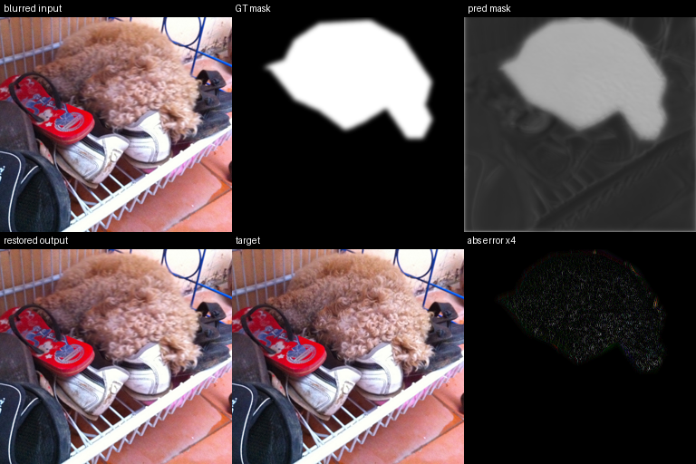
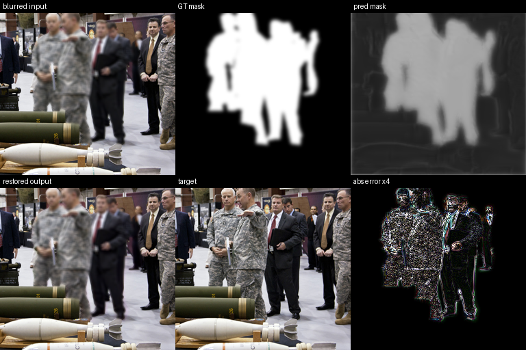
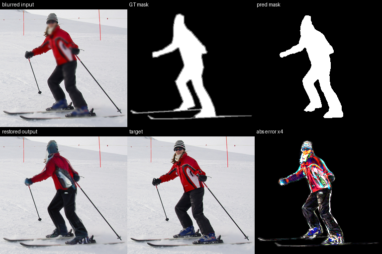
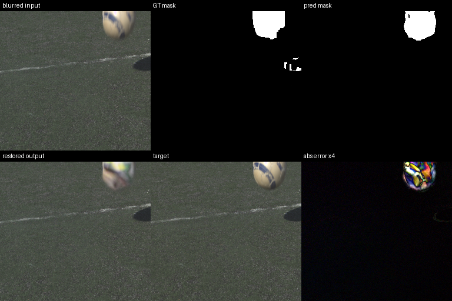
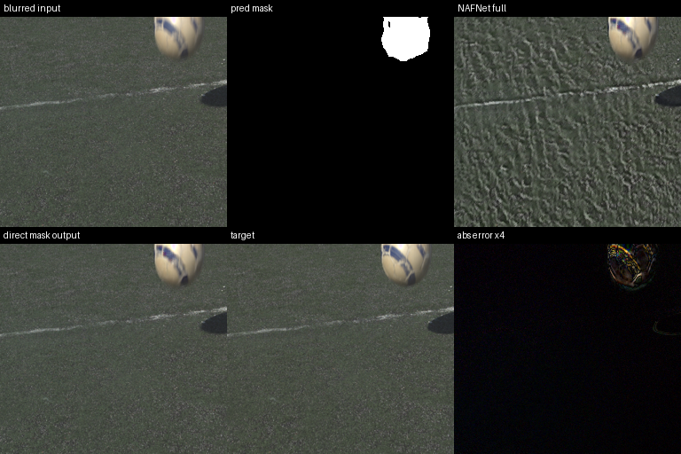
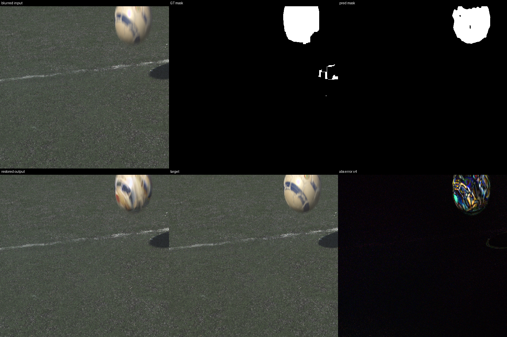

# Diffusion-Based Local Image Deblurring

Jinzi Luo (jl7199)

## Background

The original goal of this project was local image deblurring: given a blurred input image `Ib`, identify the blurred region `M`, restore only the local degraded area, and preserve the non-blurred background as much as possible. The proposal direction was Stable Diffusion + ControlNet: ControlNet receives spatial conditions such as the blurred image, blur mask, and semantic/background information, while Stable Diffusion provides a generative prior for local restoration. The training plan was to pretrain on synthetic COCO data and then fine-tune on real ReLoBlur data.

The final results did not reach the expected level of stable local deblurring described in the proposal. The issue is not a single hyperparameter. The current SD-based pipeline lacks sufficiently strong semantic and structural constraints. Even when background compositing is applied after inference, the diffusion model still tends to reconstruct or regenerate the full image internally, which can cause local content, texture, and color drift. Mask boundary errors further amplify this instability. Therefore, this report is written as an analysis-oriented summary: what was attempted, what the results show, and why the expected quality was not achieved.

## Data

Two types of data were used. The overall training flow was to pretrain on synthetic COCO data and then fine-tune on ReLoBlur.

For COCO, local blur samples were generated by applying motion, Gaussian, or defocus blur to selected target regions. Each sample stores `Ib` as the blurred input, `M` as the blur-region mask, `S` as semantic/background auxiliary information, and `target` as the sharp target image. A separate Stage 1 mask predictor was also trained using only `Ib` as input, so the mask prediction model did not receive the ground-truth mask as input. On `data/COCO/train` and `data/COCO/val`, the calibrated Stage 1 checkpoint reached mask IoU 0.8000 and Dice 0.8809 at threshold 0.55, but boundary IoU was only 0.2934. This means coarse localization was usable, while fine boundary quality remained weak.

For ReLoBlur, the dataset followed the original paper's data and mask structure and was converted into the same manifest format for fine-tuning and evaluation. Since real images are large, ReLoBlur fine-tuning used a BAPC/crop strategy. Evaluation outputs were saved in the standard format with `summary.txt`, `metrics.csv`, `answer.json`, and visual grids under `log/`. Most ReLoBlur results in this project are 5-sample infrastructure checks, not full ReLoBlur benchmarks.

## Experiments

1. **Direct SD + ControlNet joint route**: The early pipeline attempted to let SD + Tile ControlNet handle local restoration and mask-related learning together. The route could run end to end, but both mask quality and restoration quality were unstable. In the early phase1 5-sample check, mask IoU was only 0.085, showing that joint training did not reliably learn the local blur region.

2. **Separate mask prediction before restoration**: Mask prediction was split into a dedicated Stage 1 model that predicts `Ib -> M_pred`, and the predicted mask was then fed into SD + ControlNet. This made the experiment structure cleaner. The small COCO check reached mask IoU about 0.755, while the ReLoBlur small-sample check reached about 0.548. Boundary quality and domain generalization still limited the final restoration.

3. **Direct lightweight baseline training**: `ConditionalLocalDeblurNet` reached PSNR 35.54 and SSIM 0.9951 on 100 synthetic5k-val samples. This shows that local deblurring is learnable within the synthetic data distribution. However, this result is not SD + ControlNet and is not a real ReLoBlur benchmark.

4. **Mask/local preprocessing and NAFNet branches**: To reduce SD reconstruction drift, later experiments added NAFNet preprocessing or directly used ModelScope NAFNet output inside the predicted mask, with soft boundary blending. NAFNet direct achieved the highest numeric result on the 5-sample ReLoBlur check, but this is essentially local deblurring-network output blended into the original image, not evidence that SD + ControlNet solved the restoration problem.

5. **Learning-rate and training-length experiments**: The project tried a short ReLoBlur fine-tune with `lr=2e-6`, and a full-flow setting with COCO 5-epoch pretraining plus ReLoBlur 10-epoch fine-tuning at `lr=5e-7`. The full-flow 5-sample ReLoBlur PSNR improved from 28.82 to 29.61, but this does not prove stable visual quality.

6. **Lower diffusion noise / using diffusion as refinement**: Stage 3 NAFNet + ControlNet branches restricted training timesteps to low-noise ranges, for example `timestep_max=200`, and used inference `strength=0.3`. The intent was to make the diffusion model act more like a refinement tool rather than a reconstruction tool. This direction is more reasonable than pure SD reconstruction, but the current 5-sample results are still affected by mask quality, split variation, and checkpoint variance.

## Quantitative Results

| Method | Data | Samples | PSNR | SSIM | W-PSNR | W-SSIM | Mask IoU | Mask Dice | Note |
| --- | --- | ---: | ---: | ---: | ---: | ---: | ---: | ---: | --- |
| Lightweight CNN baseline | COCO synthetic5k-val | 100 | 35.538 | 0.9951 | 25.249 | 0.9431 | 0.700 | 0.812 | Non-diffusion, non-ReLoBlur baseline for local deblurring. |
| SD1.5 + Tile ControlNet with GT mask, COCO 3-epoch pretrain | COCO20k val | 5 | 25.433 | 0.9784 | 16.000 | 0.7626 | 1.000 | 1.000 | Validates the GT-mask conditioning route only. |
| Separate Stage 1 mask prediction, then SD + ControlNet | COCO20k val | 5 | 25.769 | 0.9786 | 16.401 | 0.7673 | 0.755 | 0.848 | Uses predicted `Ib -> M` mask, not GT mask. |
| COCO pretrain + ReLoBlur fine-tune at lr=2e-6, pred-mask inference | ReLoBlur test | 5 | 28.816 | 0.9194 | 19.544 | 0.8730 | 0.548 | 0.701 | 5-sample infrastructure check, not a full benchmark. |
| COCO 5-epoch pretrain + ReLoBlur 10-epoch fine-tune at lr=5e-7 | ReLoBlur test | 5 | 29.614 | 0.9333 | 20.366 | 0.8946 | 0.548 | 0.701 | Full-flow small-sample check after lr/training-length adjustment. |
| ModelScope NAFNet directly inside predicted mask with soft boundary blending | ReLoBlur test | 5 | 38.452 | 0.9817 | 30.269 | 0.9899 | - | - | Not SD reconstruction; closer to local deblurring post-processing. |
| Stage3: NAFNet preprocessing + ControlNet full-weighted loss | ReLoBlur test | 5 | 28.916 | 0.9395 | 19.641 | 0.8774 | 0.548 | 0.701 | Uses low-noise refinement with `timestep_max=200` and `strength=0.3`. |
| Stage3: NAFNet preprocessing + ControlNet mask-only loss | ReLoBlur test | 5 | 29.044 | 0.9394 | 19.795 | 0.8793 | 0.548 | 0.701 | Computes diffusion loss only inside the mask region. |
| Stage3 urgent full-weighted, batch=12 continued fine-tune | ReLoBlur test | 5 | 33.173 | 0.9490 | 24.487 | 0.9618 | 0.523 | 0.681 | Numerically better, but still only 5 samples. |
| Stage3 urgent full-weighted step210 checkpoint, seed123 split | ReLoBlur test | 5 | 34.768 | 0.9585 | 23.304 | 0.9440 | 0.335 | 0.476 | Checkpoint, split, and seed all differ, so this is exploratory only. |

`W-PSNR` and `W-SSIM` are mask-weighted metrics and focus more on the local blurred region. Most ReLoBlur results are based on only 5 samples, and different experiments may use different checkpoints, split seeds, or inference configurations. These numbers should be treated as internal analysis evidence, not final benchmark claims.

## Result Analysis

The most stable numeric results come from two routes: the direct lightweight baseline on synthetic data and the NAFNet direct local blending route. The SD + ControlNet route, which is the main proposal direction, completed the full engineering loop from data preparation, training, fine-tuning, predicted-mask inference, and visualization, but it did not show sufficiently stable local restoration quality.

There are three main reasons. First, although the mask predictor reaches calibrated IoU around 0.8 on COCO, the ReLoBlur small-sample IoU is only about 0.55. Boundary errors directly affect local blending and mask-weighted metrics. Second, the current SD route does not include strong semantic constraints. CLIP or semantic guidance is mostly weakly connected or interface-level, so the SD prior is not reliably anchored to the original image content. Third, diffusion img2img naturally tends to denoise or reconstruct the full image. Even if the background is composited back afterward, the texture, color, and structure inside the mask may still change in uncontrolled ways.

Learning-rate changes, longer training, and timestep restriction improve some metrics, but they do not fundamentally solve the issue. In particular, 5-sample ReLoBlur checks have high variance, so local metric improvements should not be interpreted as stable method success. Results such as Step210/seed123 also change checkpoint and split settings at the same time, so they are exploratory signals rather than strict single-variable ablations.

## Limitations

1. **Insufficient effective training time**: The batch-size configuration caused a serious training-efficiency problem. Runs configured with `batch_size=160` effectively completed only about 486 steps, so many GPU hours were spent on ineffective training rather than meaningful optimization. As a result, the final ControlNet did not fully converge.

2. **Distribution gap between synthetic and real data**: COCO synthetic motion blur is relatively uniform because it is generated by applying blur kernels to static images. ReLoBlur contains real blur with more complex boundaries, spatially varying severity, and less regular degradation patterns. This gap limited the benefit of the COCO pretrain to ReLoBlur fine-tune transfer.

3. **Fidelity limitation of diffusion models**: Directly using the blurred image as the ControlNet condition can introduce semantic errors. NAFNet preprocessing helped reduce this problem by providing a cleaner structural input, but NAFNet itself is still limited on severe local blur, so it could not fully solve the restoration problem.

4. **No joint optimization between mask prediction and deblurring**: The Mask Predictor and ControlNet were trained separately. Since there was no end-to-end joint optimization, mask errors could not be corrected through gradients from the restoration objective, and errors from the two modules accumulated during inference.

## Future Work

1. **Better synthetic data**: Instead of applying blur kernels to static COCO images, future work should extract real motion-blur frames from videos. This would better approximate real blur trajectories, boundaries, and spatial variation.

2. **Replace or strengthen Stage 1**: NAFNet could be replaced with a model trained specifically on ReLoBlur, or outputs from a stronger deblurring method such as LBAG could be used as Stage 1. A cleaner Stage 1 output would give ControlNet a more reliable conditioning signal.

3. **Low-timestep diffusion training**: Future experiments should emphasize a low-noise strategy such as training on timesteps 0 to 200 and using inference `strength=0.2`. The goal is to make diffusion refine details rather than rebuild image structure. This direction is also supported by fidelity-oriented diffusion restoration work such as FideDiff and OSDD.

4. **End-to-end joint training**: The Mask Predictor and ControlNet should be jointly optimized so that mask errors can be corrected through backpropagation from the deblurring loss. This would reduce error accumulation between localization and restoration.

## Discussion: Motion Blur, Fidelity, and Generation

Motion blur is fundamentally an information-loss process. A single blurred pixel or region may correspond to many possible sharp images. A diffusion model therefore tends to hallucinate details that are plausible under its learned prior. However, plausible details are not necessarily the true details of the original image. This is the root of the semantic error observed in the experiments.

This creates the core contradiction of diffusion-based local deblurring: generative models are good at producing realistic details, but deblurring requires fidelity to the original scene. The trade-off between generation and fidelity was not fully resolved within the available experimental time. The results suggest that diffusion should not be used as the main structure-reconstruction module in this setting. It is more suitable as a constrained, low-noise local refinement module after a stronger restoration backbone has already preserved the scene structure.

## Final Summary

Honestly, under the proposal's SD + ControlNet main route, the current system does not yet perform real local deblurring well enough. The experiments built a complete pipeline covering COCO synthetic data, ReLoBlur fine-tuning, mask prediction, ControlNet inference, NAFNet preprocessing, and visual result packaging, but the final quality did not meet the original expectation.

The key problem is that the SD model lacks strong enough semantic and structural constraints for this task, so local reconstruction can drift away from the original content; mask boundary errors and the lack of end-to-end optimization further amplify this problem. The fairest conclusion is that this project implemented a complete experimental framework and used multiple ablations to show that relying on SD + ControlNet alone for local deblurring is not stable. A more reliable direction is to preserve structure with a dedicated deblurring model or stronger restoration backbone first, then use diffusion only as a very low-noise local refinement module.

Note: some later branches did not redo a full systematic pretraining run. They continued from existing checkpoints or used 5-sample infrastructure checks. These results are useful as process evidence and can be uploaded with the experiment package, but they should not be presented as final SOTA results.

The full metric table is available at `report/metrics_overview.csv`.
## Representative Visual Results

Figure 1. Synthetic COCO baseline. The direct lightweight baseline performs well within the synthetic validation distribution, showing that the generated data and local supervision are learnable.

Figure 2. A harder synthetic example. Even in the synthetic baseline, mask boundaries and local details can be wrong, which explains why the later diffusion route is sensitive to mask errors.

Figure 3. COCO result using an independently predicted mask as input to SD + ControlNet. The pipeline runs end to end, but local color and structure drift can still appear.

Figure 4. ReLoBlur full-flow small-sample check. COCO pretraining plus ReLoBlur fine-tuning improves some metrics, but the result is still not a stable real-scene deblurring solution.

Figure 5. NAFNet direct blending inside the predicted mask. It gives the best numeric result, but this is local restoration-network output fusion, not proof that SD + ControlNet solved the reconstruction problem.

Figure 6. Stage3 NAFNet preprocessing + continued ControlNet training. This branch reframes diffusion as a refinement tool, but it still needs a full benchmark and more visual inspection.

